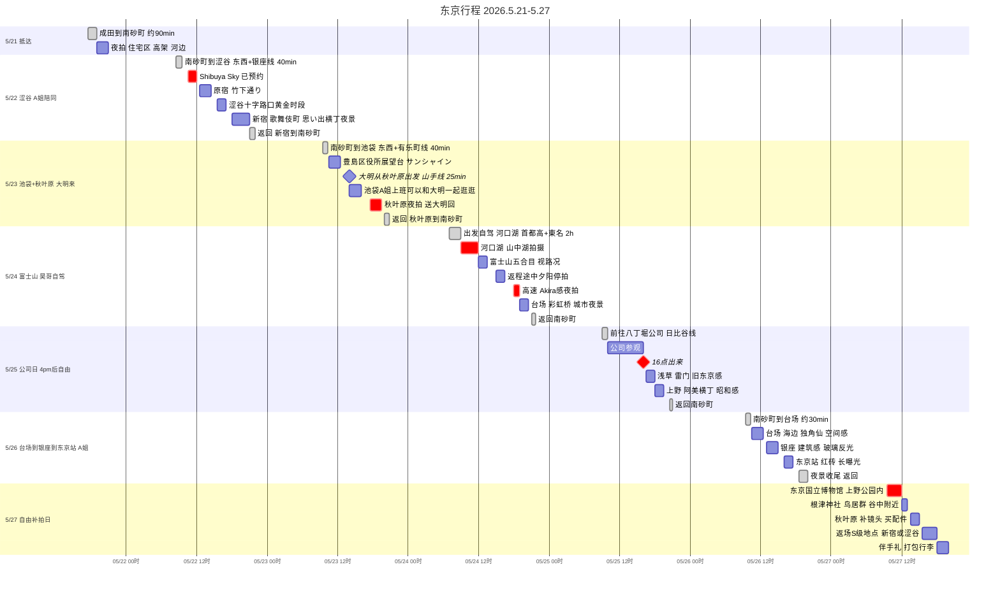

# Tokyo Akira Project - Jony Code

> BGM：Kaneda - Akira
>
> 主题：
> 霓虹东京 / 城市孤独 / 赛博朋克 / 工业东京

---

# 甘特图总览

> 可直接修改时间/内容，`crit` = 关键节点，`milestone` = 时间点，`done` = 交通段

---

# 每日路线总览

## 出发前必读

### Suica 西瓜卡

**落地第一件事就是开 Suica**，全程地铁、JR、便利店、自动贩卖机都能刷。

| 方式 | 操作 |
|---|---|
| 实体卡 | 机场绿色自动售票机 → 选 Suica → 押金 ¥500 + 充值 ¥3,000 |
| Apple Pay | iPhone 8+ → Wallet → 添加 Suica → 绑卡充值（推荐，无押金） |

充值地点：JR 售票机、7-Eleven / 全家 / 罗森 收银台均可。

**Suica 能刷哪里：**

| 场景 | 可用 |
|---|---|
| 地铁 / JR 全线 | ✅ |
| 便利店 / 自动贩卖机 | ✅ |
| 部分超市、餐厅 | ✅ |
| 景点门票（多数） | ❌ 需现金或信用卡 |

### 日元兑换

| 方式 | 建议 |
|---|---|
| 出发前换 ¥20,000 | 应急用，够前几天地铁零花 |
| **7-Eleven ATM** | 支持银联/Visa，汇率近市场价，最推荐 |
| 机场换汇 | 汇率一般，少换 |

> 小店、神社、部分售票机只收现金，建议随身备 ¥5,000~10,000 现金。

### 免税攻略

单次消费满 **¥5,000（税前）** 可退消费税（8~10%）。

- 需要护照原件，结账时说：**「免税（めんぜい）お願いします」**
- 适用：家电、相机配件、衣物、化妆品
- 不适用：便利店食品饮料
- **秋叶原买相机配件必问！** 动辄省几百块
- 免税商品会被封袋，出境前不能拆开，海关会查

### 末班车速查

**住所：南砂町（东西线）**，从各地赶回家的时间限制：

| 出发地 | 路线 | 最晚几点离开 |
|---|---|---|
| 涩谷 | 银座线→日本桥→东西线 | **23:30** |
| 新宿 | 丸ノ内線→大手町→东西线 | **23:30** |
| 池袋 | 有乐町线→飯田橋→东西线 | **23:30** |
| 秋叶原 | 日比谷线→茅场町→东西线 | **23:30** |
| 上野 / 浅草 | 日比谷线→茅场町→东西线 | **23:30** |
| 东京站 / 银座 | 大手町步行→东西线 | **00:00** |
| 台场 | りんかい線末班约 23:20 | **23:00** |

> 东西线南砂町方向末班约 **00:45**，但换乘连接线更早结束，按上表操作。
> 实际出发前用 **Google Maps → 末班车** 功能查实时时刻。

---

## 5/21（周四）· 落地 · 南砂町

**今日主题** 东京第一次呼吸 ｜ **花费预估** ¥4,000 ~ 6,000（含落地晚餐）

### 路线

成田机场 T1 → 京成 Access 特快 ¥1,330（约 40 min）→ 日本桥（步行换乘 3 min）→ 东西线 → 南砂町 ¥178

全程约 1.5 ~ 2 小时 ｜ 全程可刷 Suica ✅

### 花费明细

| 项目 | 费用 |
|---|---|
| 京成 Access 特快（成田→日本桥） | ¥1,330（约57元）|
| 东西线（日本桥→南砂町） | ¥178（约8元）|
| 落地晚餐 + 便利店补给 | ¥2,000 ~ 3,500（约86~151元）|
| **今日合计** | **¥3,500 ~ 5,000（约151~215元）**|

---

### 时间线

| 时间 | 内容 |
|---|---|
| 17:30 | 成田机场 T1 到达 |
| 19:00 | 南砂町到达（昊哥接站） |

---

### 落地清单

- 买 / 激活 Suica（绑 Apple Pay 或绿色售票机）
- 充值 ¥3,000~5,000
- 如需现金：7-Eleven ATM 取 ¥10,000
- 昊哥南砂町站接站

### 夜拍

**推荐设备** Pocket3（第一天轻松，不要压力）

拍：自动贩卖机 / 夜晚住宅区 / 高架桥 / 河边 / 电车进站

---

## 5/22（周五）· 涩谷 · A姐全天陪同

**今日主题** 霓虹赛博 · 人流延时 ｜ **花费预估** ¥12,000 ~ 15,000（含A姐·餐饮）

### 路线

**出发** 南砂町 → 东西线 → 茅场町（换乘步行 1 min）→ 银座线 → 涩谷 ｜ 约 40 min ¥220 Suica ✅

**返回** 新宿 → JR → 大手町 or 日本桥 → 东西线 → 南砂町 ｜ 约 40 min Suica ✅

### 花费明细

| 项目 | 费用 |
|---|---|
| Shibuya Sky 门票 × 2（含 A姐）| ¥4,000（约172元）|
| 地铁全天（多次换乘·涩谷↔原宿↔新宿）| ¥1,000（约43元）|
| 请 A姐茶饮小食 | ¥800（约34元）|
| 餐饮（含A姐·涩谷/新宿价位）| ¥5,000 ~ 8,000（约215~344元）|
| 便利店补给（全天高频）| ¥1,000 ~ 1,500（约43~65元）|
| **今日合计** | **¥11,800 ~ 15,300（约508~658元）**|

---

### 时间线

| 时间 | 内容 |
|---|---|
| 08:30 | 南砂町出发 |
| 09:30 | 到达涩谷 |
| 10:30 | **Shibuya Sky**（已预约，不可迟到！票价 ¥2,000） |
| 12:00 | 涩谷街拍 |
| 14:00 | 原宿·竹下通り |
| 14:30 | 可加：明治神宮（原宿步行 5 分钟，巨型木鸟居+神宫森林，逛 40 分钟） |
| 15:30 | 涩谷十字路口（傍晚人流最密） |
| 18:00 | 新宿·歌舞伎町·思い出横丁 |
| 19:00 | **离开新宿** → 丸ノ内線→大手町→东西线→南砂町，约40分钟，约19:40到家 |

> ⚠️ **19:00 出发**，末班最晚23:30，但别赌。

---

### 核心镜头

#### 涩谷

- 十字路口·人群延时（全画幅长曝）
- 高空车流（Shibuya Sky）
- Osmo360 放在路口地面拍仰角

---

#### 新宿

- 3D猫
- 小巷·霓虹灯
- 思い出横丁·昭和居酒屋烟气
- 雨夜反光（如遇雨天是最佳）

---

### 推荐设备

| 场景 | 设备 |
|---|---|
| Shibuya Sky 高空全景 | 全画幅 + Osmo360 |
| 街头 vlog 跟拍 | Pocket3 |
| 十字路口地面仰角 | Osmo360 |
| 新宿夜景 | 全画幅 |

---

## 5/23（周六）· 池袋 · A姐上班 · 大明来

**今日主题** 东京生活感 · 电子噪音 ｜ **花费预估** ¥8,000 ~ 11,000（含大明·餐饮）

### 路线

**出发** 南砂町 → 东西线 → 饭田桥（换有乐町线）→ 池袋 ｜ 约 38 min ¥210 Suica ✅

**大明来汇合** 秋叶原 → JR 山手线（内回）→ 池袋 ｜ 约 22 min，9 站不换乘 ✅

**返回** 秋叶原 → 东西线 → 南砂町 ｜ 约 38 min ¥200 Suica ✅（注意站台方向）

### 花费明细

| 项目 | 费用 |
|---|---|
| 地铁全天（南砂町↔池袋↔秋叶原）| ¥900（约39元）|
| 豊島区役所展望台 | 免费 |
| サンシャイン展望台 × 2（大明，可选）| ¥1,400（约60元）|
| 请大明茶饮 + 小食 | ¥1,500（约65元）|
| 餐饮（含大明·池袋/秋叶原）| ¥4,000 ~ 6,000（约172~258元）|
| 便利店补给 | ¥800 ~ 1,200（约34~52元）|
| **今日合计** | **¥7,600 ~ 11,000（约327~473元）**|

---

## 时间线

| 时间 | 内容 |
|---|---|
| 09:30 | 南砂町出发 |
| 10:30 | 豊島区役所展望台（免费，俯瞰池袋全景） |
| 11:30 | サンシャインシティ |
| 14:00 | 大明从秋叶原到达，池袋集合 |
| 14:00 | 三人一起逛·乙女ロード·东池袋公园 |
| 17:30 | 出发秋叶原 |
| 18:00 | 秋叶原夜拍（送大明回家） |
| 19:00 | **离开秋叶原** → 东西线直达南砂町，约38分钟，约19:40到家 |

> ⚠️ **19:00 出发**，末班最晚23:30，但别赌。

---

### 核心拍摄

**池袋**：商场·电车·学生·生活街区，豊島区役所展望台全景（全画幅，免费）

**秋叶原**：扭蛋·动漫广告·电器店，霓虹广告牌（Pocket3 跟拍），女仆店门口氛围

---

## 5/24（周日）· 富士山 · 昊哥自驾全天

**今日主题** 自然史诗 · Akira 感高速 ｜ **花费预估** ¥9,000 ~ 13,000（含昊哥·餐饮）

**有车 = 质变**，这一天是整部片子的高潮段。

### 路线（自驾）

南砂町
-> 首都高速湾岸線（C1 方向）
-> 東名高速
-> 河口湖 IC
-> 河口湖·山中湖

约 2 ~ 2.5 小时（早出发避堵）

返程：
富士吉田
-> 東名 or 中央道
-> 途中夕阳停拍
-> 回东京后绕台场
-> 返回南砂町

### 花费明细

| 项目 | 费用 |
|---|---|
| 各景点停车费（富士山+台场）| ¥2,000（约86元）|
| 请昊哥全天吃饭（午餐+休息站）| ¥5,000（约215元）|
| 高速油费 | 昊哥承担 🙏 |
| 高速休息站补给 + 个人餐饮 | ¥2,500 ~ 4,000（约108~172元）|
| 便利店（夜拍补给·行车饮料）| ¥1,000（约43元）|
| **今日合计** | **¥9,500 ~ 12,000（约409~516元）**|

---

## 时间线

| 时间 | 内容 |
|---|---|
| 07:00 | 出发（早！避高速堵车） |
| 09:00 | ⭐ 河口湖（湖面倒影·富士全景） |
| 11:00 | 山中湖（更宽广的视野） |
| 12:00 | 富士山五合目（视路况，5月末雪线确认） |
| 15:00 | 返程途中夕阳停拍 |
| 18:00 | 进入首都高速 |
| 18:00 ~ 19:00 | ⭐⭐ 高速公路 Akira 感夜拍（核心段！） |
| 19:00 | 台场·彩虹桥·城市夜景 |
| 21:00 | 返回南砂町 |

> ⚠️ 富士山五合目（スバルライン）5月末视路况，出发前确认是否开放：
> https://www.fujisan-climb.jp/

---

### 必拍内容

**白天**：富士山湖边倒影·电线杆，Osmo360 放湖边拍 360 全景

**傍晚**：公路·车流·山路·夕阳

**夜晚（重点）** 回东京途中高速上：东京高速·夜景 / 后视镜构图 / 霓虹·隧道光线

> **非常有《Akira》感**

---

### 推荐设备

| 场景 | 设备 |
|---|---|
| 富士山景·湖面 | 全画幅 |
| 车窗·车载 | Action5（吸盘固定） |
| 河口湖 360 全景 | Osmo360 |
| 返程 vlog | Pocket3 |
| 高速夜景 | 全画幅（ISO高，手持或车顶） |

---

## 5/25（周一）· 公司日 · 16 点后自由

**今日主题** 旧东京 · 昭和感 ｜ **花费预估** ¥5,000 ~ 7,000（含餐饮）

### 路线

**去公司** 南砂町 → 东西线 → 茅场町（换乘步行 1 min）→ 日比谷线 → 八丁堀 ｜ 约 15 min ¥178 Suica ✅

**16 点后** 八丁堀 → 日比谷线 → 上野（18 min）→ 步行至浅草（20 min 或地铁 1 站）

**返回** 上野 → 日比谷线 → 茅场町 → 东西线 → 南砂町 ｜ 约 35 min Suica ✅

### 花费明细

| 项目 | 费用 |
|---|---|
| 地铁全天（公司往返+浅草+上野）| ¥700（约30元）|
| 浅草寺 · 上野 | 免费 |
| 餐饮（浅草/上野区域）| ¥3,500 ~ 5,000（约151~215元）|
| 便利店补给 | ¥800 ~ 1,200（约34~52元）|
| **今日合计** | **¥5,000 ~ 6,900（约215~297元）**|

---

## 时间线

| 时间 | 内容 |
|---|---|
| 16:00 | 出来！ |
| 16:30 | 浅草·雷門·仲見世通り（夕阳光打过来很好看） |
| 18:00 | 上野·阿美横丁·昭和感街拍 |
| 19:00 | **离开上野** → 日比谷线→茅场町→东西线→南砂町，约35分钟，约19:35到家 |

> ⚠️ **19:00 出发**，末班最晚23:30，但别赌。

---

### 拍什么

#### 浅草（旧东京主题）

- 雷門·仲見世通り夕阳
- 老街·居酒屋·昭和感招牌
- 人力车·传统服装

---

#### 上野

- 阿美横丁（热闹市场感）
- 老街·居酒屋·昭和感

> 前几天都是未来东京 / 赛博东京，今天切到**旧东京**，形成叙事节奏对比。

---

## 5/26（周二）· 台场 · 银座 · 东京站 · A姐陪同

**今日主题** 未来东京白天感 · 建筑秩序 ｜ **花费预估** ¥9,000 ~ 13,000（含A姐·台場）

### 路线

**出发** 南砂町 → りんかい線 → 東京テレポート（台场）｜ 约 30 min ¥400 Suica ✅

**台场→银座** りんかい線 → 新木場（换有乐町线）→ 銀座 ｜ 约 25 min ¥280 Suica ✅

**银座→东京站** 步行 10 min

**返回** 东京站 → 大手町（步行连通）→ 东西线 → 南砂町 ｜ 约 35 min Suica ✅

### 花费明细

| 项目 | 费用 |
|---|---|
| 地铁全程（りんかい線+多次换乘）| ¥1,500（约65元）|
| 台场 · 银座 · 东京站 | 免费 |
| 请 A姐在银座喝咖啡 | ¥1,200（约52元）|
| 餐饮（含A姐·台場/銀座价位）| ¥5,000 ~ 8,000（约215~344元）|
| 便利店补给（暴走全天）| ¥1,000 ~ 1,500（约43~65元）|
| **今日合计** | **¥8,700 ~ 12,200（约374~525元）**|

---

## 时间线

| 时间 | 内容 |
|---|---|
| 09:30 | 南砂町出发 |
| 10:30 | 台场·独角仙·海滨公园·彩虹桥全景 |
| 13:00 | 前往银座 |
| 13:30 | 银座·建筑感·玻璃反光·秩序感 |
| 15:30 | 可加：増上寺（东京塔为背景的古寺，银座步行 20 分钟） |
| 16:00 | 东京站·红砖·长曝光·行人 |
| 18:30 | 夜景收尾 |
| 19:00 | **离开东京站** → 大手町（步行连通）→东西线→南砂町，约35分钟，约19:35到家 |

> ⚠️ **19:00 出发**，末班最晚00:00，但别赌。

---

### 拍什么

**台场**（你还缺"未来东京的白天感"）：海边·彩虹桥全景·空旷建筑·巨型结构

**银座**：秩序感·建筑感·玻璃反光·品牌招牌

**东京站**：红砖外墙·长曝光·行人虚影·夜晚车流

### 推荐设备

| 场景 | 设备 |
|---|---|
| 台场全景 | Osmo360 |
| 海边 vlog | Pocket3 |
| 银座建筑 | 全画幅 |
| 东京站夜景 | 全画幅（三脚架 / 稳定）|

---

## 5/27（周三）· 自由补拍日

**今日主题** 补完 · 收尾 ｜ **花费预估** ¥22,000 ~ 42,000（含购物·餐饮）

**主要任务**：① 补镜头 ② 买伴手礼 ③ 回最喜欢的地方

---

### 路线

南砂町 → 东西线 → 大手町（换丸ノ内線）→ 上野御徒町
-> 步行 5 分钟入上野公園
-> ⭐ 东京国立博物馆（9:30 开门，逛 2~3 小时）
-> 步行 15 分钟 -> 根津神社（鸟居群）
-> 日比谷线 1 站 -> 秋叶原（补最后镜头）
-> 新宿 or 涩谷（伴手礼·最后返场）

---

### 花费明细

| 项目 | 费用 |
|---|---|
| 地铁全程（上野→秋叶原→新宿/涩谷）| ¥1,200（约52元）|
| 东京国立博物馆 | ¥1,000（约43元）|
| 根津神社 | 免费 |
| 朋友伴手礼（A姐·昊哥·大明各份）| ¥10,000 ~ 18,000（约430~774元）|
| 自己纪念品·购物 | ¥5,000 ~ 15,000（约215~645元）|
| 餐饮（最后一天好好吃）| ¥3,500 ~ 5,000（约151~215元）|
| 便利店补给 | ¥800（约34元）|
| **今日合计** | **¥21,500 ~ 41,000（约924~1763元）**|

### 东京国立博物馆 攻略

> 这就是你说的那个！日本最大、最古老的博物馆。

| 项目 | 内容 |
|---|---|
| 正式名称 | 東京国立博物館（TNM） |
| 地址 | 上野公園内（上野駅から徒歩 10 分） |
| 开放时间 | 周二～周日 9:30 ~ 17:00 |
| 夜间延长 | 特展期间周五/周六延至 21:00 |
| 休馆日 | **周一（重要！）** |
| 门票 | 常设展 ¥1,000，特展另计 |
| 拍摄 | 常设展区域**可以拍**，特展禁拍 |

> ⚠️ **5/25 周一博物馆关门，不能去！** 安排在 5/27（周三）完全正确。

### 馆内必看

| 馆 | 亮点 |
|---|---|
| 本館（日本美术） | 浮世絵、刀剣（武士刀）、铠甲、佛像 |
| 法隆寺宝物館 | 国宝级文物，灯光极美，很适合全画幅拍摄 |
| 東洋館 | 中国·朝鲜·东南亚文物 |
| 平成館 | 日本考古学常设 + 特别展览 |

### 拍摄提示

- **法隆寺宝物館**：昏暗灯光、金属质感文物，全画幅高 ISO 最出片
- **本館大阶梯**：复古建筑感，Pocket3 跟拍走动很有质感
- **上野公園**：进入前先拍公园入口大鸟居、喷水池

---

### 根津神社 攻略

> 东京版"伏见稻荷"，少了游客多了氛围。

| 项目 | 内容 |
|---|---|
| 地址 | 文京区根津 1-28-9 |
| 距上野 | 步行 15 分钟 / 千代田线根津站 1 分钟 |
| 开放时间 | 全年 6:00 ~ 17:00（免费） |
| 拍摄 | 朱红色鸟居群，早上光线最佳 |

鸟居通道不长但很密集，全画幅压缩焦段拍纵深感极好。

---

### 最推荐返场

新宿 · 歌舞伎町 · 涩谷 — 第一次一定拍不够。

---

## 时间线

| 时间 | 内容 |
|---|---|
| 09:30 | 东京国立博物馆（上野公园内，步行 10 分钟入园） |
| 12:00 | 根津神社（步行 15 分钟，鸟居群·早光最佳） |
| 13:30 | 秋叶原（补镜头·买配件，日比谷线 1 站） |
| 15:30 | 新宿 or 涩谷（伴手礼·最后返场，JR山手线约30分钟） |
| 18:00 | **离开新宿/涩谷** → 回南砂町，约40分钟，约18:40到家 |
| 19:00 | 打包行李，收工 |

> ⚠️ **18:00 出发**，明天要回国，别拖太晚。

---

## 全程花费预估

> 汇率按 **¥1,000 日元 = 43元人民币** ｜ 城市摄影 / 创作旅行真实版，不含机票和住宿

### 一、每日活动 + 交通 + 社交（不含餐饮）

| 日期 | 主要支出 | 日元 | 折合人民币 |
|---|---|---|---|
| 5/21 | 机场交通（京成+东西线）| ¥1,508 | 约 65元 |
| 5/22 | 地铁(¥1,000) + Shibuya Sky×2(¥4,000) + A姐请客(¥800) | ¥5,800 | 约 249元 |
| 5/23 | 地铁(¥900) + 展望台×2(¥1,400) + 请大明(¥1,500) | ¥3,800 | 约 163元 |
| 5/24 | 停车(¥2,000) + 请昊哥全天(¥5,000) + 补给(¥1,000) | ¥8,000 | 约 344元 |
| 5/25 | 地铁 | ¥700 | 约 30元 |
| 5/26 | りんかい線+地铁(¥1,500) + 请A姐(¥1,200) | ¥2,700 | 约 116元 |
| 5/27 | 地铁(¥1,200) + 博物馆(¥1,000) | ¥2,200 | 约 95元 |
| **活动+交通+社交小计** | | **约 ¥24,700** | **约 1,062元** |

### 二、每日生活消费（真实版）

| 类别 | 真实单日参考 | 7天合计 | 折合人民币 |
|---|---|---|---|
| 餐饮（早+午+晚+咖啡）| **¥4,000 ~ 6,000/天** | ¥28,000 ~ 42,000 | 约 1,204 ~ 1,806元 |
| 便利店补给（水/能量饮料/热食/夜拍补糖）| **¥800 ~ 1,500/天** | ¥5,600 ~ 10,500 | 约 241 ~ 452元 |
| **生活消费小计** | | **¥33,600 ~ 52,500** | **约 1,445 ~ 2,258元** |

> 🚨 ¥1,500/天 是极限省钱模式。实际去涩谷/銀座/台場，随便一家咖啡 ¥800+，正餐 ¥1,500~3,500，吃好点的居酒屋轻松 ¥4,000+。

### 三、备用 / 特殊支出

| 类别 | 建议预留 | 折合人民币 | 说明 |
|---|---|---|---|
| **相机 / 拍摄应急** | **¥10,000 ~ 20,000** | 约 430 ~ 860元 | SD卡·电池·吸盘·配件·秋叶原很危险 |
| **打车 / 应急** | **¥10,000** | 约 430元 | 夜拍超时·下雨·错过换乘·改路线 |
| **伴手礼 + 购物** | **¥15,000 ~ 30,000** | 约 645 ~ 1,290元 | Loft/Hands/Donki/東京站/秋叶原 |
| Suica 押金 | ¥500 | 约 22元 | Apple Pay 无需 |

### 四、总预算参考

| 档次 | 日元 | 折合人民币 | 适合场景 |
|---|---|---|---|
| 🟡 **最低安全线** | **¥80,000** | **约 3,440元** | 克制消费，不太购物 |
| 🟢 **推荐舒适预算** | **¥100,000 ~ 120,000** | **约 4,300 ~ 5,160元** | 正常游玩 + 适量购物 |
| 🔵 **高自由度** | **¥150,000+** | **约 6,450元+** | 含大量购物 + 随心消费 |

> 💡 建议随身备足 **¥20,000~30,000 现金**，日本现金文化依然普遍。
> 💡 7-Eleven ATM 支持银联/Visa，汇率接近市场价，比机场换汇划算。
> 💡 上表不含机票和住宿。

---

# ✈️ 回国安排

> ⚠️ **还需要你告诉我：回国日期 + 出发机场（成田 or 羽田）**
> 我好帮你确认当天路线和时间。

---

## 参考路线

| 机场 | 推荐方式 | 从南砂町出发 | 大约时间 |
|---|---|---|---|
| 成田空港 | スカイライナー（日暮里乗換） | 东西线→日暮里 | 约 70 分钟 |
| 成田空港 | N'EX | 东西线→大手町→东京站 | 约 80 分钟 |
| 羽田空港 | 京急線 | 东西线→日本桥→浅草線→品川→羽田 | 约 50 分钟 |
| 羽田空港 | 东京モノレール | 东西线→浜松町→羽田 | 约 50 分钟 |

> 国际航班建议出发前 **3 小时** 到达机场。
> 行李重的话 **提前一天** 寄送机场（宅急便，コンビニ可办理）。

---

# 东京拍摄 Checklist

## 每天必拍（比景点更重要）

| 类型 | 必拍 |
|---|---|
| 声音 | 地铁广播、电车进站 |
| 转场 | 红绿灯、自动扶梯 |
| 氛围 | 雨夜地面、便利店 |
| 东京感 | 自动贩卖机 |
| Akira感 | 高架桥、工业区 |
| 人群 | 十字路口、晚高峰 |
| 孤独感 | 深夜河边、空街道 |

---

## 设备分工总结

| 设备 | 最佳时机 |
|---|---|
| 全画幅相机 | 夜景/建筑/人文街拍 |
| Pocket3 | 城市 vlog/跟拍/稳定移动 |
| Osmo360 | 涩谷Sky / 河口湖 / 台场（三大时机！）|
| Action5 | 车载·车窗·高速公路·运动场景 |

---

# 最后一个重要建议

东京不要拍太"满"。

你这个主题最重要的是：

# 留白

比如：

- 空镜
- 风声
- 电车声
- 红灯等待
- 河边
- 人群沉默

这些会让《Kaneda》真正有灵魂。
